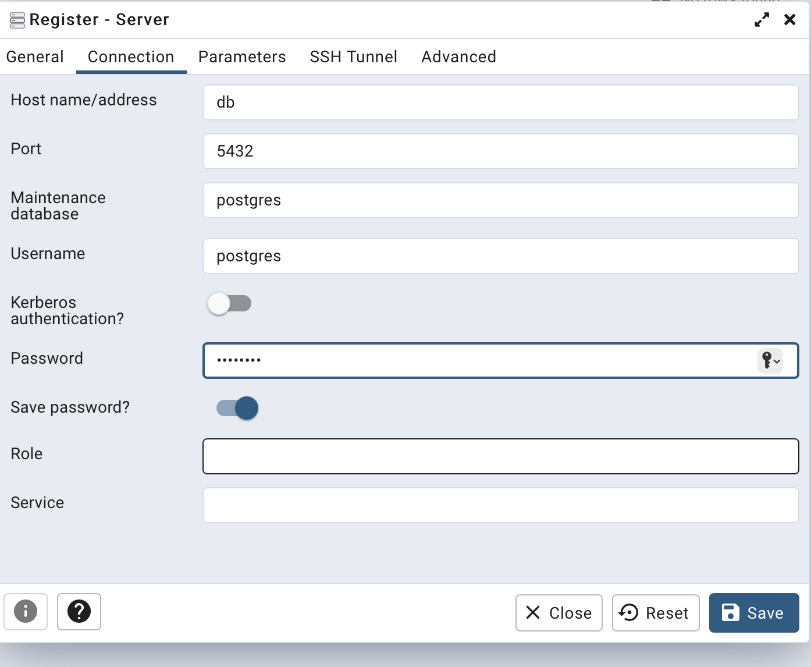

# EventBooking
Sports event booking system. Django project

## Uruchomienie
```sh
docker compose up
```
## Korzystanie z pg admina

1. Wejdz i zaloguj się http://localhost:8080
username: admin@admin.com
pass: admin
2. Dodaj bazę danych1

Servers -> Register -> Name ustawiamy dowolnie
Przejdz do zakładki Connections


hasło to: postgres


## Wchodzenie do środka kontenera
```sh
docker exec -it eventbooking-web-1 /bin/bash
```